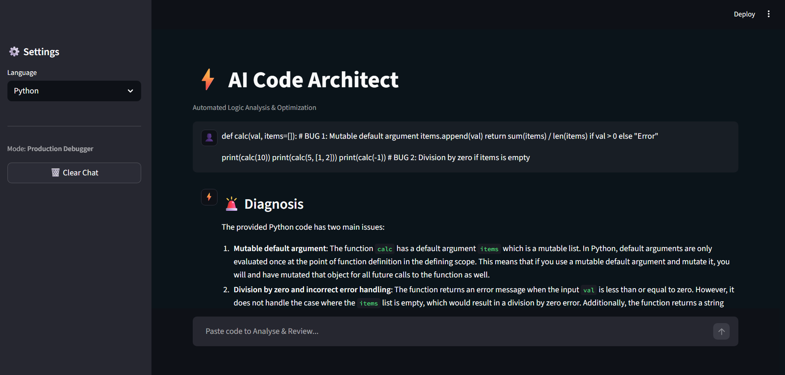

# ⚝ AI Code Debugger (AI Code Architect)

[]()
[]()
[]()
[]()

**AI Code Debugger** (branded as *AI Code Architect*) is an advanced real-time code analysis tool designed to help developers identify syntax errors, logical bugs, and optimization opportunities.

Powered by **Groq (Llama-3)** for high-speed inference and **HuggingFace Embeddings** for RAG (Retrieval-Augmented Generation), this tool provides instant, context-aware feedback in a professional chat interface.

---

## 🚀 Key Features

* **⚡ Ultra-Fast Analysis:** Uses Groq's LPU inference engine with Llama-3-70b/Mixtral models.
* **🧠 RAG Integration:** Retrieves coding "Best Practices" from a local Vector Database (FAISS) to ground the AI's responses.
* **💬 Modern Chat UI:** Features a WhatsApp-style interface with "User-Right / Bot-Left" alignment and typing animations.
* **🐞 Dual-Layer Detection:** Identifies both **Syntax Errors** (missing colons, brackets) and **Logic Errors** (infinite loops, resource leaks).
* **🌊 Streaming Responses:** Simulates a natural conversation with typewriter-style text streaming.

---

## 🛠️ Tech Stack

* **Frontend:** [Streamlit](https://streamlit.io/) (Custom CSS for Dark Mode & Layout)
* **LLM Engine:** [Groq API](https://groq.com/) (Llama-3 / Mixtral)
* **Orchestration:** [LangChain](https://www.langchain.com/)
* **Embeddings:** HuggingFace (`all-MiniLM-L6-v2`)
* **Vector Store:** FAISS (CPU Optimized)

---

## 📂 Project Structure

```text
AI-Code-Debugger/
├── .env                  # API Keys (Create this file manually)
├── .gitignore            # Git ignore rules
├── requirements.txt      # Python dependencies
├── main.py               # Application Entry Point (UI & Stream Logic)
└── src/
    ├── __init__.py
    ├── llm_engine.py     # RAG Logic, Groq Client, & Streaming
    └── utils.py          # Custom CSS, Animations, & Layout Configuration

```

---

## ⚙️ Installation & Setup

Follow these steps to set up the project locally.

### 1. Clone the Repository

```bash
git clone [https://github.com/yathik-2622/AI-Code-Debugger.git](https://github.com/yathik-2622/AI-Code-Debugger.git)
cd AI-Code-Debugger

```

### 2. Create a Virtual Environment (Optional but Recommended)

```bash
# Windows
python -m venv venv
venv\Scripts\activate

# Mac/Linux
python3 -m venv venv
source venv/bin/activate

```

### 3. Install Dependencies

```bash
pip install -r requirements.txt

```

### 4. Configure API Keys

Create a file named `.env` in the root directory and add your Groq API Key:

```ini
GROQ_API_KEY=gsk_your_actual_api_key_here

```

*(You can get a free key from [console.groq.com](https://console.groq.com/keys))*

### 5. Run the Application

```bash
streamlit run main.py

```

---

## 🧪 Usage Guide

1. **Select Language:** Choose your programming language (Python, C++, Java, etc.) from the sidebar.
2. **Paste Code:** Paste your buggy code snippet into the chat input bar at the bottom.
3. **Analyze:** Press Enter. The AI will:
* Show a "Thinking" animation (Bouncing dots).
* Retrieve relevant coding context.
* Stream a detailed report including **Diagnosis**, **Fix**, and **Explanation**.


---

## 📸 Screenshots



---

## 🤝 Contributing

Contributions are welcome! Please feel free to submit a Pull Request.

1. Fork the Project
2. Create your Feature Branch (`git checkout -b feature/AmazingFeature`)
3. Commit your Changes (`git commit -m 'Add some AmazingFeature'`)
4. Push to the Branch (`git push origin feature/AmazingFeature`)
5. Open a Pull Request

---

## 📄 License

This project is licensed under the MIT License - see the [LICENSE](https://www.google.com/search?q=LICENSE) file for details.

```

```